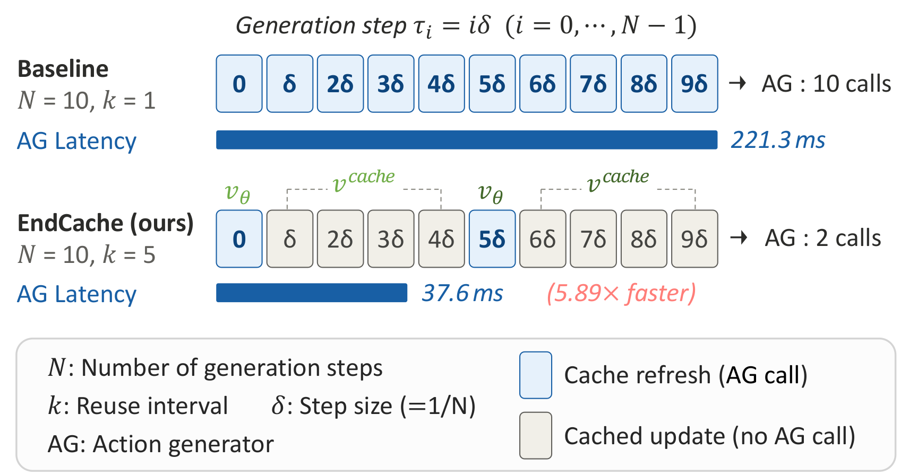
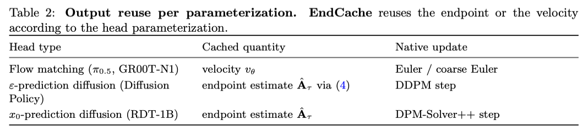

# EndCache: What to Reuse in Generative Robot Policies?

Official implementation of **“What to Reuse in Generative Robot Policies? A Solver-Aware Mathematical Analysis of Training-Free Output Caching for Action Generation.”**

[](img/overview.pdf)

EndCache reuses outputs from the action generator of a pretrained generative robot policy without retraining. It preserves the original solver grid and evaluates the action head only when `i % k == 0`. At intermediate steps, it applies a **hold-only** rule that reuses the most recent fresh output. This reduces the action-head NFE from `N` to `ceil(N / k)`.

## What Is Cached



For Diffusion Policy, `noise hold` is included only as an output-space ablation. The primary EndCache setting is `endpoint hold`.

## Repository Layout

```text
EndCache_What_to_Reuse/
├── img/
│   ├── overview.pdf
│   ├── overview.png
│   └── Table2.png
├── configs/
│   ├── paper_protocol.toml
│   ├── libero_tasks.toml
│   └── gr1_tasks.txt
├── patches/
│   ├── diffusion_policy.patch
│   ├── openpi_pi05.patch
│   ├── groot_n17.patch
│   ├── rdt.patch
│   └── groot_n16.patch
├── src/endcache/
│   ├── core.py                 # Backend-independent hold cache and Algorithm 1 loop
│   ├── torch_diffusion.py      # DDPM epsilon-to-endpoint adapter
│   ├── runtime.py              # Shared runtime variables
│   └── latency.py              # CUDA-event latency utility
├── THIRD_PARTY_NOTICES.md
└── pyproject.toml
```

## Installation

Install EndCache in each upstream project's environment:

```bash
python -m pip install -e .
```

## Preparing and Patching Upstream Repositories

Pinned revisions are listed in `configs/paper_protocol.toml`. Set `ENDCACHE_ROOT` once, and run server and client commands in separate terminals.

```bash
export ENDCACHE_ROOT=/path/to/EndCache_What_to_Reuse
```

### π0.5 / openpi

```bash
git clone https://github.com/Physical-Intelligence/openpi.git
cd openpi
git checkout 650c5b0283a49c42784fb5055a0507da2c6d347d
patch -p1 < "$ENDCACHE_ROOT/patches/openpi_pi05.patch"
```

EndCache patches `PI0Pytorch`. Use a PyTorch `pi05_libero` checkpoint containing `model.safetensors` and the LIBERO normalization assets. Convert a JAX checkpoint first if needed.

```bash
uv run examples/convert_jax_model_to_pytorch.py \
  --checkpoint_dir /path/to/pi05_libero_jax \
  --config_name pi05_libero \
  --output_path /path/to/pi05_libero_pytorch
```

```bash
# Server example: N=10, k=5
ENDCACHE_NUM_STEPS=10 ENDCACHE_INTERVAL=5 \
  uv run scripts/serve_policy.py --port 8000 \
  policy:checkpoint \
  --policy.config pi05_libero \
  --policy.dir /path/to/pi05_libero_pytorch

# Client: one suite/seed cell from the paper protocol
python examples/libero/main.py \
  --args.host 127.0.0.1 \
  --args.port 8000 \
  --args.task-suite-name libero_spatial \
  --args.num-trials-per-task 50 \
  --args.seed 7 \
  --args.replan-steps 5
```

Protocol: `k ∈ {1, 2, 3, 4, 5, 10}`, four LIBERO suites, evaluation seeds `{7, 42, 123}`, and 50 trials per task.

### GR00T-N1.7

```bash
git clone https://github.com/NVIDIA/Isaac-GR00T.git
cd Isaac-GR00T
git checkout 3df8b3825d67f755e69141446f4315f281b9b7e6
patch -p1 < "$ENDCACHE_ROOT/patches/groot_n17.patch"
```

Prepare the GR00T server environment and the LIBERO simulation environment according to the upstream instructions.

```bash
# Server example: N=4, k=2
ENDCACHE_NUM_STEPS=4 ENDCACHE_INTERVAL=2 \
  uv run python gr00t/eval/run_gr00t_server.py \
  --model-path /path/to/GR00T-N1.7-LIBERO/libero_spatial \
  --embodiment-tag LIBERO_PANDA \
  --use-sim-policy-wrapper \
  --port 5555

# Client: one task/seed cell
gr00t/eval/sim/LIBERO/libero_uv/.venv/bin/python \
  gr00t/eval/rollout_policy.py \
  --env-name libero_sim/TASK_NAME \
  --n-episodes 50 \
  --n-envs 5 \
  --max-episode-steps 720 \
  --n-action-steps 8 \
  --policy-client-host 127.0.0.1 \
  --policy-client-port 5555 \
  --seed 7
```

Protocol: `k ∈ {1, 2, 4}`, four LIBERO suites, evaluation seeds `{7, 42, 123}`, and **50 trials per task**. The patch truncates simultaneous vector-environment completions so that exactly the requested number of episodes is counted.

### Diffusion Policy

```bash
git clone https://github.com/real-stanford/diffusion_policy.git
cd diffusion_policy
git checkout 5ba07ac6661db573af695b419a7947ecb704690f
patch -p1 < "$ENDCACHE_ROOT/patches/diffusion_policy.patch"
```

Use the upstream `robodiff` Conda environment and checkpoints. Set the following runtime variables before the existing evaluator command.

```bash
# Primary EndCache setting: endpoint hold, N=100, k=10
ENDCACHE_NUM_STEPS=100 ENDCACHE_INTERVAL=10 DP_ENDCACHE_SPACE=endpoint \
  python eval.py --checkpoint /path/to/checkpoint.ckpt --output_dir /path/to/output_endpoint

# Output-space ablation: noise hold, without extrapolation
ENDCACHE_NUM_STEPS=100 ENDCACHE_INTERVAL=10 DP_ENDCACHE_SPACE=noise \
  python eval.py --checkpoint /path/to/checkpoint.ckpt --output_dir /path/to/output_noise
```

The paper protocol evaluates approximately 60 DP-CNN and DP-Transformer checkpoints with 50 evaluation episodes per checkpoint. The group counts are recorded in the protocol config.

### RDT-1B

```bash
git clone https://github.com/thu-ml/RoboticsDiffusionTransformer.git RDT
cd RDT
git checkout cd79363a1387e8f81c7724d070ef7e45fd23150f
patch -p1 < "$ENDCACHE_ROOT/patches/rdt.patch"
```

Prepare the upstream RDT and ManiSkill environments, the RDT checkpoint, and the vision and text encoders. The patch enforces the evaluator's 400-step rollout horizon at the environment `TimeLimit`.

```bash
# N=5, k=3, one task and one reset seed
ENDCACHE_NUM_STEPS=5 ENDCACHE_INTERVAL=3 \
  python -m eval_sim.eval_rdt_maniskill \
  --pretrained_path /path/to/rdt-checkpoint \
  --env-id PickCube-v1 \
  --num-traj 25 \
  --random_seed 0
```

Protocol: five ManiSkill tasks, `k ∈ {1, 2, 3, 5}`, reset seeds `0..9`, 25 trajectories per seed, and a 400-step horizon. Each seed initializes the environment RNG on the first reset, after which the RNG stream continues for the remaining trajectories.

### GR00T-N1.6 / RoboCasa GR1

```bash
git clone https://github.com/NVIDIA/Isaac-GR00T.git Isaac-GR00T-N1.6
cd Isaac-GR00T-N1.6
git checkout ead52833afbbf4243f8cd5e7664f48a94de03b19
patch -p1 < "$ENDCACHE_ROOT/patches/groot_n16.patch"
```

```bash
# Server example: N=4, k=4
ENDCACHE_NUM_STEPS=4 ENDCACHE_INTERVAL=4 \
  uv run python gr00t/eval/run_gr00t_server.py \
  --model-path nvidia/GR00T-N1.6-3B \
  --embodiment-tag GR1 \
  --use-sim-policy-wrapper \
  --port 5555

# Client: one task from configs/gr1_tasks.txt
gr00t/eval/sim/robocasa-gr1-tabletop-tasks/robocasa_uv/.venv/bin/python \
  gr00t/eval/rollout_policy.py \
  --env_name TASK_NAME \
  --n_episodes 200 \
  --n_envs 5 \
  --max_episode_steps 720 \
  --n_action_steps 8 \
  --policy_client_host 127.0.0.1 \
  --policy_client_port 5555
```

Protocol: `k ∈ {1, 2, 4}`, all 24 tasks, and 200 episodes per task in a single unseeded run, as reported in the paper.

## Latency Measurement

The paper measures latency on an NVIDIA A6000 with batch size 1, 30 warmup iterations, 100 measured repetitions, and CUDA events. Replace `backend_specific_model_call` with the actual backend call boundary:

```python
from endcache.latency import benchmark_cuda_events

operation = lambda: backend_specific_model_call(...)
summary = benchmark_cuda_events(operation, warmup=30, repeats=100)
print(summary.mean_ms, summary.std_ms)
```

For E2E, VLM, and action-generator latency, use the same backend input and change only the callable boundary. Here, E2E means model inference including the VLM prefix and action generator; it excludes simulator and client-server communication.

## Runtime Variables

| Variable | Meaning | Default |
|---|---|---:|
| `ENDCACHE_INTERVAL` | reuse interval `k` | `1` |
| `ENDCACHE_NUM_STEPS` | solver step count `N` | upstream default |
| `DP_ENDCACHE_SPACE` | `endpoint` or `noise` for Diffusion Policy | `endpoint` |

Every cache is reset for each new action chunk. With `k=1`, every step performs a fresh evaluation.

## Acknowledgements

This implementation consists of minimal patches applied to the official codebases of the evaluated models.

- [Diffusion Policy](https://github.com/real-stanford/diffusion_policy)
- [openpi](https://github.com/Physical-Intelligence/openpi)
- [NVIDIA Isaac GR00T](https://github.com/NVIDIA/Isaac-GR00T)
- [Robotics Diffusion Transformer](https://github.com/thu-ml/RoboticsDiffusionTransformer)
- [LIBERO](https://github.com/Lifelong-Robot-Learning/LIBERO)
- [ManiSkill](https://github.com/haosulab/ManiSkill)

See [THIRD_PARTY_NOTICES.md](THIRD_PARTY_NOTICES.md) for pinned revisions and license scopes.
